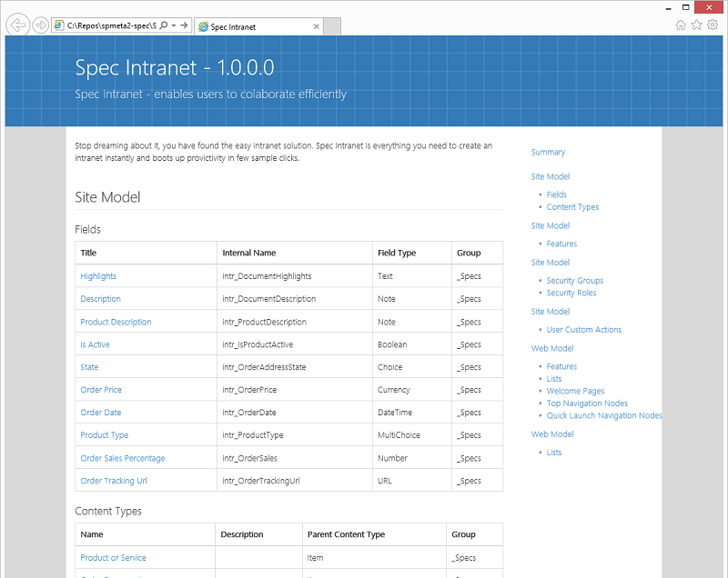
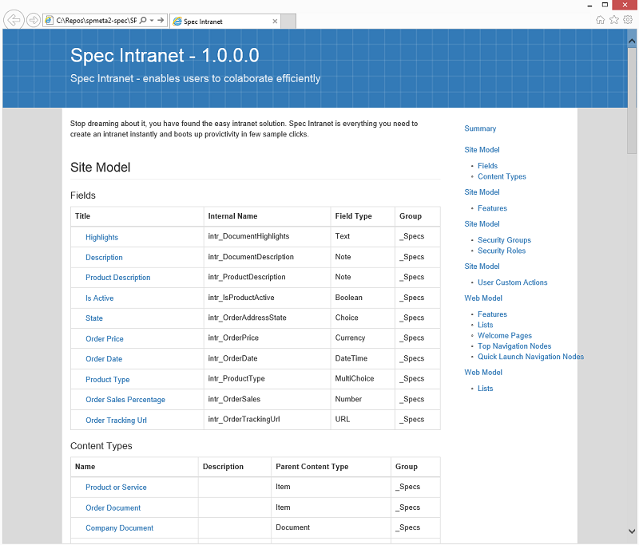

---
Title: 'M2 Spec Home'
Tile: true
TileTitle: 'M2 Spec'
TileOrder: 60
TileLink: true
TileLinkOrder: 10
TileDescription: 'Technical documentation made easy - build beautiful one-page specifications for SPMeta2 models.'
---

## SPMeta2.Specs in details

SPMeta2.Specs - CI1

SPMeta2.Specs provides a simple API to generate beautiful one page HTML technical specifications based on your SPMeta2 models. It helps to improve development workflow filling the lack of documentation - now all information architecture, fields, content types, list and libraries and the rest of the artifacts are structured and presented in a nice way.

Not only it cuts a huge amount of time on crafting and keeping technical specificatoins up to date but also brings professional looking specs so that your clients would be always impressed with your work.

### Feature requests, support and contributions

In case you have unexpected issues or keen to see new features please contact support on SPMeta2 Yammer or here at github:

* [https://www.yammer.com/spmeta2feedback](https://www.yammer.com/spmeta2feedback)
* [M2 Spec on Yammer](https://www.yammer.com/spmeta2feedback/#/threads/inGroup?feedId=6858117)

### M2 Specs API

More samples on usage can be found in unit tests under ["SpecTests" class](https://github.com/SubPointSolutions/spmeta2-spec/blob/dev/SPMeta2.Spec/SPMeta2.Spec.Tests/Tests/SpecTests.cs), and here are the basics to get started:

```cs
// 1 - create spec service
var specService = new SpecService();


// 2- define metadata of the specs to be generat
// SpecMetadata follows Nuspec Reference - https://docs.nuget.org/create/nuspec-reference
var specMetadata = new SpecMetadata
{
    Id = "Spec.Intranet.Model",
    Title = "Spec Intranet",
    Version = "1.0.0.0",
    Description = "Spec Intranet - enables users to colaborate efficiently",
    Summary = "Stop dreaming about it, you have found the easy intranet solution. Spec Intranet is everything you need to create an intranet instantly and boots up provictivity in few sample clicks.",
    Copyright = "Copyright © Spec Intranet 2015"
};

// 3 - optionally create an instance of the theme
// default themes are under 'SPMeta2.Spec.Defaults' namespace

// spec theme
// ThemeBase specTheme = null;
//ThemeBase specTheme = new DefaultTheme();
//ThemeBase specTheme = new DefaultBlueprintTheme();
//ThemeBase specTheme = new DefaultMetroBootstrapTheme();
ThemeBase specTheme = new DefaultMetroBootstrapBlueprintTheme();


// 4 - create a list of the models to be used in the final spec
var specModels = new List<ModelNode>();

// fill out the specModels collection with your models

// 5 - generate the spec
// the spec is one-page HTML file

// current themes use Bootstrap, embed all css/js/font in the page
// all themes are 'printable', so that you can print all the info as you need
var specFileContent = specService.GenerateSpecs(
                        specMetadata,
                        specModels,
                        specTheme);

// here we go, specFileContent contains generated HTML
// let's open it up and see what's there for us                       

var specFileName = string.Format("m2-spec-{0}.html", Environment.TickCount);
File.WriteAllText(specFileName, specFileContent);

Process.Start("explorer.exe", specFileName);
```
### M2 Spec sample output

Here are a few one page specs generated for [SPMeta2 starter Intranet Model](/SPMeta2-VS):

* [m2-spec-DefaultBluePrintTheme.html](https://github.com/SubPointSolutions/spmeta2-spec/tree/dev/SPMeta2.Spec/SPMeta2.Spec.Tests/SampleOutput)
* [m2-spec-DefaultMetroBootstrapTheme.html](https://github.com/SubPointSolutions/spmeta2-spec/tree/dev/SPMeta2.Spec/SPMeta2.Spec.Tests/SampleOutput)
* [m2-spec-DefaultTheme.html](https://github.com/SubPointSolutions/spmeta2-spec/tree/dev/SPMeta2.Spec/SPMeta2.Spec.Tests/SampleOutput)
* [m2-spec-MetroBootstrapBlueprint.html](https://github.com/SubPointSolutions/spmeta2-spec/tree/dev/SPMeta2.Spec/SPMeta2.Spec.Tests/SampleOutput)

Here are a few sceenshots on how it looks like:

**MetroBootstrapBlueprint theme in action**


**DefaultBluePrintTheme theme in action**
